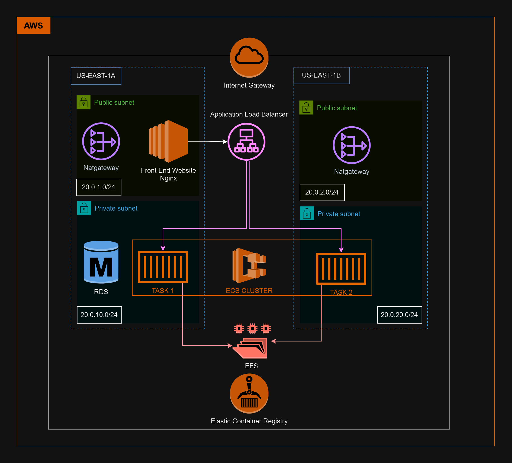

# ECS Fargate with EFS Terraform Project

## Overview

This project uses Terraform to set up an AWS ECS Fargate environment with EFS integration. The infrastructure includes a VPC with public and private subnets, an Internet Gateway, NAT Gateway, ECS Cluster, ECS Task Definition, ECS Service, and EFS File System with mount targets and access points.

## Table of Contents

- [Overview](#overview)
- [Architecture](#architecture)
- [Prerequisites](#prerequisites)
- [Installation](#installation)
- [Usage](#usage)
- [Configuration](#configuration)
- [Modules](#modules)
- [Outputs](#outputs)
- [Contributing](#contributing)
- [License](#license)

## Architecture

The architecture includes:
- A VPC with public and private subnets across multiple availability zones.
- An Internet Gateway for public subnets.
- A NAT Gateway for private subnets.
- An ECS Cluster with Fargate tasks.
- An EFS File System accessible from ECS tasks.

## Prerequisites

- [Terraform](https://www.terraform.io/downloads.html) >= 0.12
- AWS CLI configured with appropriate permissions
- [Docker](https://www.docker.com/get-started) (if applicable)

## Installation

1. **Clone the repository:**
    ```sh
    git clone https://github.com/yourusername/your-repo.git
    cd your-repo
    ```

2. **Initialize Terraform:**
    ```sh
    terraform init
    ```

3. **Plan the infrastructure changes:**
    ```sh
    terraform plan
    ```

4. **Apply the infrastructure changes:**
    ```sh
    terraform apply
    ```

## Usage

To deploy the infrastructure, run:
```sh
terraform apply